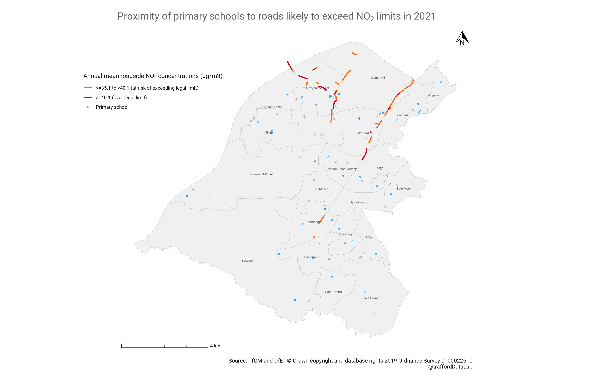
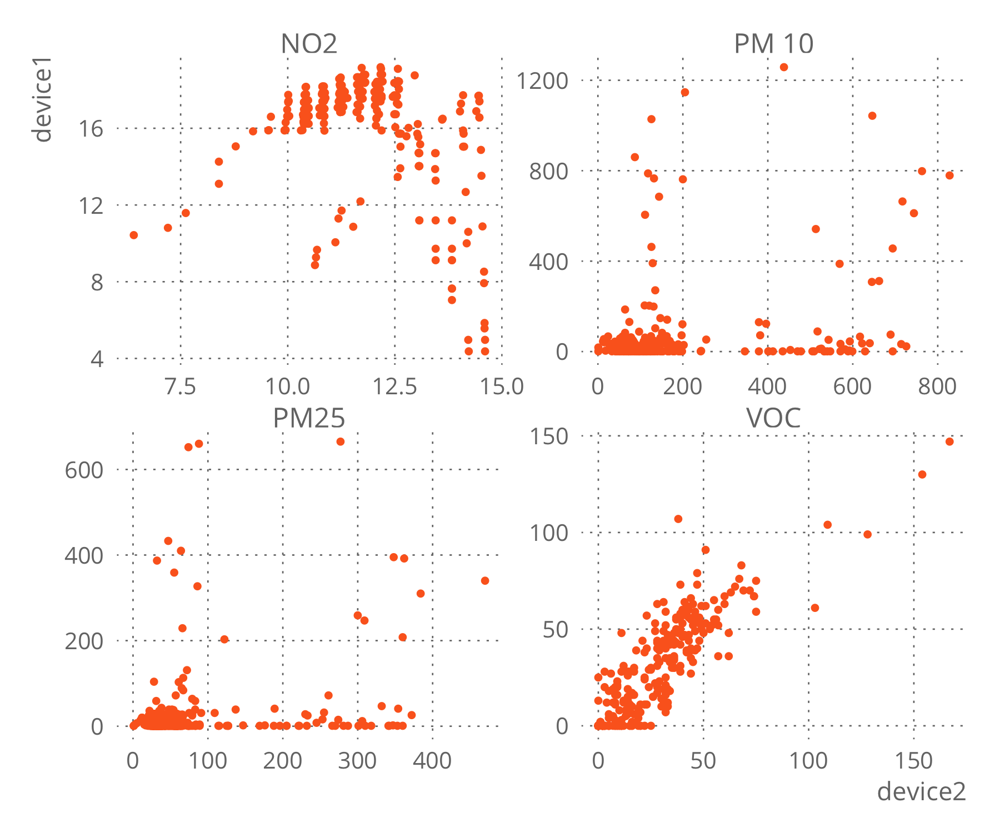
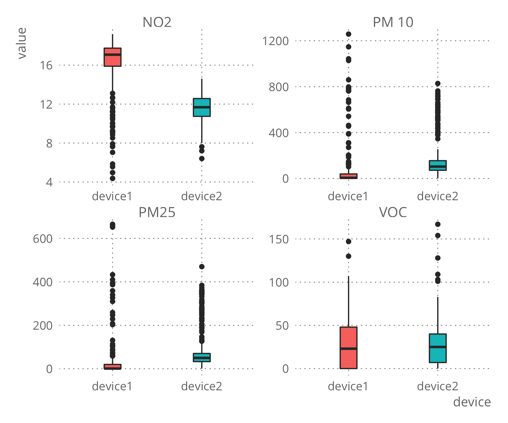
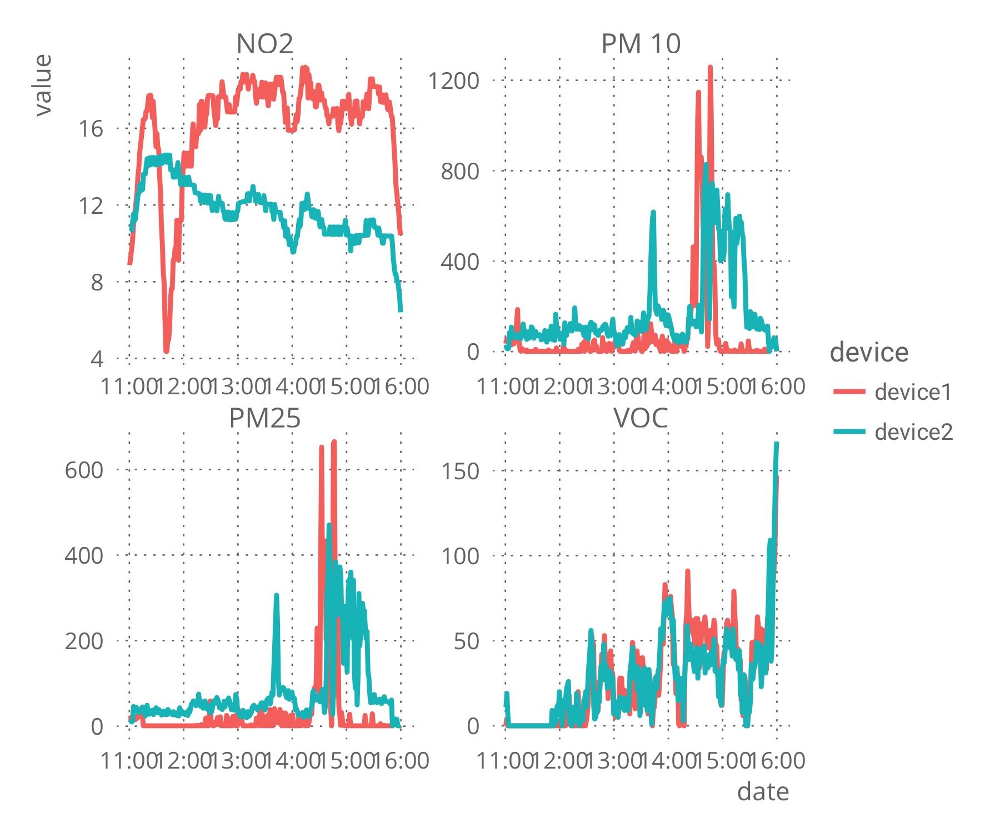
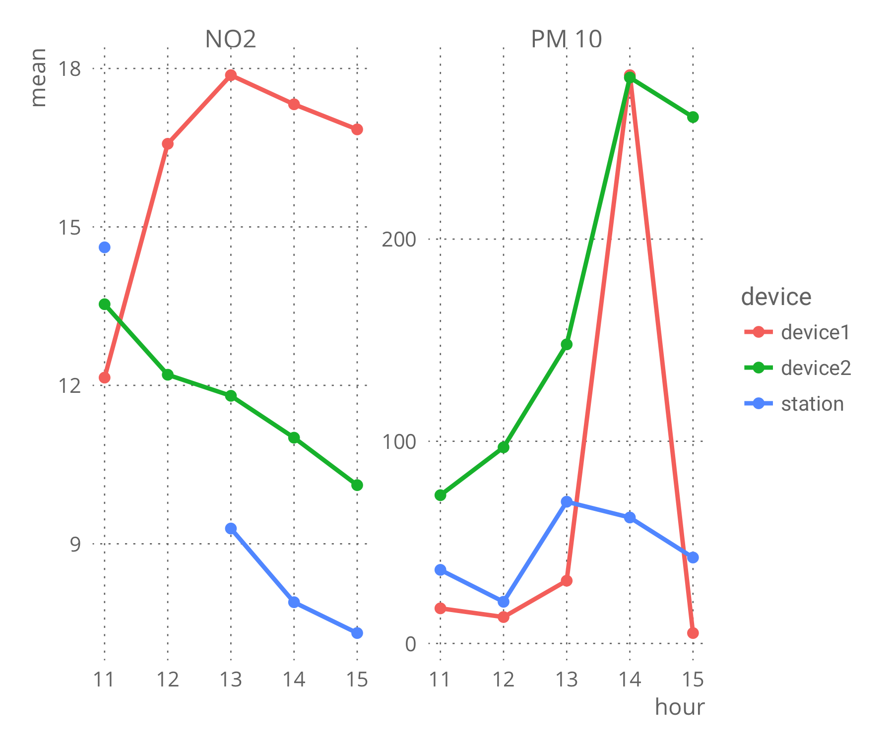

 
 
 
## Use of low cost air quality monitors to evaluate the air quality of Trafford
 
 
#### Background
Greater Manchester is developing a Clean Air Plan[1](https://cleanairgm.com/clean-air-plan) to reduce levels of roadside air pollution across the Combined Authority. A recent TfGM study[2](https://www.tfgm.com/press-release/clean-air-report-2018) identified 152 stretches of road that were likely to record levels of nitrogen dioxide that exceed legal limits (over 40 µg/m3) in 2020 if no action was taken. Several of these sections of road are within Trafford[3](https://cleanairgm.com/which-roads-are-affected). Trafford Council[4](https://www.trafford.gov.uk/residents/environment/pollution/air-quality/air-quality.aspx) have identified improving air quality as a priority and are actively contributing to the Clean Air Plan.

The Trafford Council monitors the air quality at three sites, however air quality at local level is not currently monitored.

Portable low cost air quality monitors could provide an insight into air quality levels in local areas, although currently they are not recommended to provide quantitative data to identify places that exceed legal limits of pollution.[5](https://uk-air.defra.gov.uk/library/aqeg/pollution-sensors/how-could-I-use.php)

According to the World Health Organisation, children are particularly affected by air pollution[6](https://apps.who.int/iris/bitstream/handle/10665/275545/WHO-CED-PHE-18.01-eng.pdf) and so investigating levels of pollution at places where children spend most time such as schools, could help to identify places where actions to reduce exposure are needed.

Other local authorities in the UK are already addressing the problem of air pollution at schools. The Mayor of London launched the Mayor’s School Air Quality Audit Programme in January 2017 with the aim to reduce the exposure of primary school children to air pollution. The programme resulted in the completion of audits at 50 primary schools and a toolkit of measures that could be used by other schools[7](https://www.london.gov.uk/sites/default/files/20180523_saq_master_project_report_inc_append_-_final_v6.0_gla_frmt.pdf).

The Institute for Public Policy Research presented air quality snapshots from studies carried out by Friends Of Earth using diffusion tubes. The study reveal the existence of several locations within Greater Manchester that at the time of the snapshot exceed the annual average limit of NO2. [8](https://www.ippr.org/files/2018-06/1528816909_gm-air-quality-june18.pdf)

 
 

#### Objectives

The present preliminary study explores the possibility of using a portable low cost air quality monitor to evaluate the air quality at a local level. In the first part the measures will be compared to those recorded by one of the Trafford's monitoring stations to know more about the device's accuracy. In the second part the devices will be used to measure the air quality on school sites close to roads that are likely to exceed legal limits of nitrogen dioxide by 2020 within Trafford. These measurements could help to identify schools that are currently experiencing high levels of pollution and therefore be candidates for further investigation.

 

#### Identification of schools

The proximity of Trafford's primary schools to road stretches that are likely to exceed legal levels of pollution by 2020 was calculated using the R package geosphere[9](https://www.rdocumentation.org/packages/geosphere) and based on the location of the schools and the road stretches shown in Figure 1.

 

<figure align="center">
    
    <figcaption><strong>Figure 1</strong> Trafford's primary schools and road stretches that are likely to exceed legal levels of pollution by 2020</figcaption>
</figure>

 
 
 
 

**Table 1** Schools nearest to the road stretches that are likely to exceed legal levels of pollution by 2020 if no action is taken.

|No|  School  |      Distance [m]     |
|:--|:----------|:-------------|
|1|Kingsway Primary School|44.4|
|2|Highfield Primary School|100.5|
|3|St Hugh of Lincoln RC Primary School|119.5|
|4|Gorse Hill Primary School|122.4|
|5|Victoria Park Junior School|125.4|
|6|Barton Clough Primary School|158.3|
|7|St Matthew's CofE Primary School|206.5|
|8|St Ann's RC Primary School|213.5|
|9|Tyntesfield Primary School|271.5|
|10|Victoria Park Infant School|287.9|
|11|Navigation Primary School|386.2|
|12|Park Road Academy Primary School|407.0|
|13|Longford Park School|550.9|
|14|Our Lady of the Rosary RC Primary School|578.1|
|15|Woodheys Primary School|623.1|
|16|Park Road Sale Primary School|691.9|
|17|Broadheath Primary School|717.4|
|19|Davyhulme Primary School|725.1|
|20|Moss Park Junior School|762.6|

 
#### Portable low cost air quality monitors

Low-cost air quality monitors are suitable for providing quantitative information on the levels of pollution over short periods of time and/or along a route when properly calibrated[10](https://uk-air.defra.gov.uk/library/aqeg/pollution-sensors.php). The intended application of most of these devices is to assess personal exposure, although they could find application in awareness raising, educational purposes, or on behaviour change studies, such as the study conducted in a primary school in London involving school children, parents and staff[11](https://www.ingentaconnect.com/content/ioep/rfa/2018/00000002/00000002/art00006#Metr).

There is interest in using networks of these devices to gain insight into level of air pollution in areas that static monitor stations cannot provide. The use of low-cost air quality sensors has also been proposed along with modelling and reference instruments to improve the quality of the data generated. However currently these sensors are not recommended to produce quantitative data when used on its own.[12](https://www.sciencedirect.com/science/article/pii/S0160412016309989)

 

#### Air quality tracker: Flow

The proposed device for measurements is the Flow air quality tracker. [13](https://flow.plumelabs.com) The device measures real-time concentrations of Nitrogen dioxide (NO2), Volatile Organic Compounds (VOC), PM2.5 and PM10 particulate matter. A companion iOS or Android smartphone app uses the device's inbuilt GPS receiver to geotag readings in time and space. The resulting data can then be visualised in the smartphone app or requested from the manufacturer for use in other software. The pollutants are provided in the following units: NO2 and VOC in particles per billion (ppb) and PM2.5 and PM10 in micrograms per cubic meter (ug/m3)

According to the manufacturer, the data are calibrated and adjusted for weather conditions using artificial intelligence so they recommend synchronising the app with the server regularly.

The device needs to be charged for a period of 5 hours and the battery lasts around 24 hours.

 
#### Assessing the accuracy of the unit sensor.

The World Meteorological Organisation has published an overview and future applications of low-cost sensors to measure atmospheric composition recommending R2, RMSE and MAE as metrics for sensor performance evaluation.[14](https://www.wmo.int/pages/prog/arep/gaw/documents/Draft_low_cost_sensors.pdf)

The validation of the low cost air pollution sensors is normally performed against government monitors and research-grade instruments.[12](https://www.sciencedirect.com/science/article/pii/S0160412016309989) For the present report, the comparison will be only performed against the Trafford Council monitoring station located at [Moss Park School](https://www.airqualityengland.co.uk/site/latest?site_id=TRAF) as research-grade instruments were not available. Two flow devices were compared to the monitoring station from 11:00 to 16:00 on 15/02/2019.

The measurements from the monitoring station were extracted from airqualityengland.co.uk.[15](https://www.airqualityengland.co.uk/site/latest?site_id=TRAF) The units of the NO2 measures were converted to ppb to be able to compare them with the measures from the Flow devices. The conversion[16](http://www.apis.ac.uk/unit-conversion) required temperature and pressure data which were obtained from the nearest Met Office Observational Site Rostherne No 2.[17](http://wow.metoffice.gov.uk/observations/details/20190215eqwdofjtdre6ubuhyyb96sc89w)

When evaluating low cost sensors for air quality, the literature highlights the importance of the calibration process, which in the case of the Flow device is performed during a training period when the device is used for the first time and subsequently by using artificial intelligence when the app is synchronised to the server. According to the manufacturer, Flow devices also use artificial intelligence to adjust for changes in the meteorological conditions on outdoors measures when low cost sensors are reported to perform their lowest.[14,](https://www.wmo.int/pages/prog/arep/gaw/documents/Draft_low_cost_sensors.pdf)[12](https://www.sciencedirect.com/science/article/pii/S0160412016309989)

An inter-sensor comparison between the two devices is presented  for the same period of comparison to the monitoring station using the inter-sensor variability and descriptive statistics although these statistics are normally calculated using three devices.[18](https://www.mdpi.com/2073-4433/10/2/41/htm),[19](http://www.aqmd.gov/docs/default-source/aq-spec/protocols/sensors-field-testing-protocol.pdf?sfvrsn=0) The inter-sensor variability provide a measure of how close the measurements from the devices are to each other.

 

#### Results

#####Inter-sensor comparison

<figure align="center">
    
    <figcaption><strong>Figure 2</strong> Scatterplot Device 1 vs Device 2</figcaption>
</figure>

 
 
 
 
 
 

**Table 2** Device 1 and Device 2 correlation.

|  Pollutant  |      Correlation      |
|----------|:-------------:|
| NO2 |  -0.32 |
| PM10 |    0.30 |
| PM2.5 | 0.28|
| VOC | 0.87 |

 

**Table 3** Descriptive statistics for each pollutant and device

|device|key|mean|median|min|max|sd|variance|
|--------:|-------:|--------:|-------:|--------:|-------:|--------:|-------:|
|device1|NO2|16.14|17.07|4.37|19.18|2.89|8.40|
|device2|NO2|11.72|11.67|6.40|14.60|1.42|2.04|
|device1|PM10|70.18|6.00|1.00|1258.00|190.56|36314.75|
|device2|PM10|172.04|104.00|1.00|828.00|180.48|32573.81|
|device1|PM2.5|31.97|1.00|1.00|665.00|94.87|9002.15|
|device2|PM2.5|80.56|50.00|1.00|470.00|88.31|7798.93|
|device1|VOC|27.57|23.00|0.00|147.00|26.43|698.59|
|device2|VOC|26.46|25.00|0.00|167.00|24.55|603.00|

 

<figure align="center">
    
    <figcaption><strong>Figure 3</strong> Boxplot of Device 1 vs Device 2</figcaption>
</figure>

 

**Table 3** Inter-sensor variability

|Pollutant|I-s v (%)|
|--------|:-------:|
|NO2|31.72|
|PM10|84.10|
|PM2.5|86.35|
|VOC|4.07|

 

<figure align="center">
    
    <figcaption><strong>Figure 4</strong> Time series of recordings every minute.</figcaption>
</figure>

 

##### Monitoring station data

<figure align="center">
    
    <figcaption><strong>Figure 5</strong> Hourly mean of NO2 and PM 10 for the station and devices</figcaption>
</figure>

 
 
 
 

**Table 4** Performance of Device 1

|Pollutant|R|R2|RMSE|MAE|
|--------|:--:|:-------:|--------|:-------:|
|NO2|-0.91|0.84|8.05|7.5|
|PM10|0.49|0.24|101.2|64.35|

 

**Table 5** Performance of Device 2

|Pollutant|R|R2|RMSE|MAE|
|--------|:--:|:-------:|--------|:-------:|
|NO2|0.96|0.93|2.5|2.37|
|PM10|0.49|0.24|147.03|123.33|

 

#### Discussion and conclusion

The Flow device contains sensors to measure four pollutants. From Figure 2, VOC shows a clear linear relationship between the measures of the two devices and a strong correlation 0.87. However, the other three pollutants do not present clear linear relationships and low correlation variables with a negative correlation for NO2.
Figure 3 presents boxplots and Table 2 some descriptive statistics for both devices. For VOC the boxplot shows similar distribution of the measures but for the rest of the pollutants the mean and the interquartile range are different. The inter-sensor variability indicate that the measurements of VOC are close between both devices. For NO2, PM10 and PM2.5 the measures vary more, specially in the case of the PM measures. Figure 4 shows the timeline during the comparison period.

Figure 5 present a timeline of the hourly mean for NO2 and PM10 for each device and the station. Table 4 and 5 compare each the devices against the monitoring station, Device 1 is negatively correlated with the measurements for NO2 and has a lower correlation for PM10. Device 2 present a better correlation for NO2 with a lower correlation for PM10. The RMSE and MAE for PM10 on both devices is show that the Flow devices record much higher levels than the station.

The high discrepancy on the measures produced by the devices against the station may be due to the lack of capacity of the sensors to adapt to outdoor conditions for long periods. Additionally the devices present high inter sensor variability except from VOC measures. This may be due to the artificial intelligence algorithms applied for data correction and calibration that depend on previous places and levels measured making each device "unique" according to they manufacturers.

Although the Flow devices may not be appropriate for providing reliable measures to evaluate if a particular place exceed legal limits of pollution, their easy-to-use characteristics made them ideal for educational purposes or behavioural change studies.

After encountering lack of consistency and reliability on the devices, the second part of the study was not pursued.

 

#### References

1. Clean Air GM, 2019. Greater Manchester Clean Air Plan. Retrieved from https://cleanairgm.com/clean-air-plan
2. TfGM, 2019. Full extent of Greater Manchester’s air quality problem revealed in new report. Retrieved from https://www.tfgm.com/press-release/clean-air-report-2018
3. Clean Air GM. Which roads are affected? Retrieved from https://cleanairgm.com/which-roads-are-affected
4. Trafford Council Air Pollution. https://www.trafford.gov.uk/residents/environment/pollution/air-quality/air-quality.aspx
5. AQEG When could I use a low-cost sensor? https://uk-air.defra.gov.uk/library/aqeg/pollution-sensors/how-could-I-use.php
6. Air Pollution and Child. WHO. Retrieved from https://apps.who.int/iris/bitstream/handle/10665/275545/WHO-CED-PHE-18.01-eng.pdf
7. The Mayor's School Air Quality Audit Program. Mayor of London. Retrieved from https://www.london.gov.uk/sites/default/files/20180523_saq_master_project_report_inc_append_-_final_v6.0_gla_frmt.pdf
8. Atmosphere: Towards a proper strategy for tackling Greater Manchester's air pollution crisis. Retrieved from https://www.ippr.org/files/2018-06/1528816909_gm-air-quality-june18.pdf
9. Geosphere R Package. https://www.rdocumentation.org/packages/geosphere
10. AQEG advice on the use of 'low-cost' pollution sensors. Retrieved from https://uk-air.defra.gov.uk/library/aqeg/pollution-sensors.php
11. Making the invisible visible: Engaging school children in monitoring air pollution in London. Retrieved from https://www.ingentaconnect.com/content/ioep/rfa/2018/00000002/00000002/art00006#Metr
12. Can commercial low-cost sensor platforms contribute to air quality monitoring and exposure estimates? Retrieved from https://www.sciencedirect.com/science/article/pii/S0160412016309989
13. FLow by Plume Labs. https://flow.plumelabs.com
14. Low-cost sensors for the measurement of atmospheric composition: overview of topic and future applications. Draft copy. https://www.wmo.int/pages/prog/arep/gaw/documents/Draft_low_cost_sensors.pdf
15. Air Quality England. https://www.airqualityengland.co.uk/site/latest?site_id=TRAF
16. Air Pollution Information System: Unit Conversion. http://www.apis.ac.uk/unit-conversion
17. Met Office Weather Observations Website. http://wow.metoffice.gov.uk/observations/details/20190215eqwdofjtdre6ubuhyyb96sc89w
18. Performance Assessment of a Low-Cost PM2.5 Sensor for a near Four-Month Period in Oslo, Norway. Retrieved from https://www.mdpi.com/2073-4433/10/2/41/htm
19. Field Evaluation of Low-Cost Air Quality Sensors. Retrieved from http://www.aqmd.gov/docs/default-source/aq-spec/protocols/sensors-field-testing-protocol.pdf?sfvrsn=0
20. Plume AQI: An Air Quality Index aligned with health
recommendations. Retrieved from https://drive.google.com/file/d/1-vRmFP8npb1rPrF9pvcqPk8pI7jM-CvY/view
